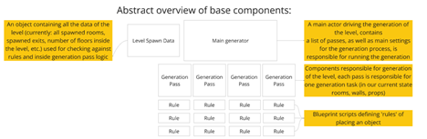
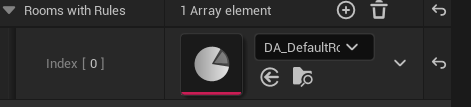
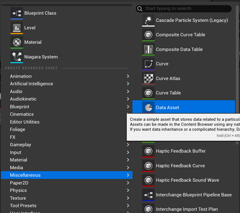
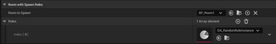
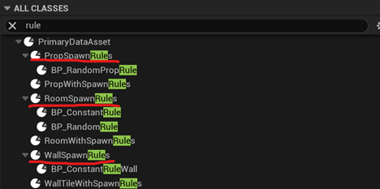
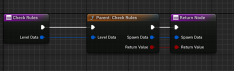

# FluczakUnrealDungeonGenerator

## Overview

Fluczak Unreal Dungeon Generator is an Unreal engine plugin created during work on a roguelike game project called [break a bot](https://store.steampowered.com/app/3365860/Breakabot/) for my 3rd year project in Breda University of Applied Sciences. The game required flexible and robust tool for generating and hand cratfting rooms that can later be stitched into a game level. The generator's functionality allows for:

- Creating room templates that are later streamed into the level in high performance.
- Easy extendability based on modular generation passes.
- Spawning rulesets for generation of rooms, props and wall tiles using blueprint scripting allowing for complete customizability
- Procedural wall tile generation for faster wall placement
- Generation inside the editor 
- Prop previewing tool
- Handling of levels with verticality and multiple floors
- Very rudimentary loops
- Enemy spawning (part of break a bot functionality)

Example levels generated with the tool:

Layouts with different rules showing robustness of the tool using several simple room templates

<table>
<tr>
<th>

</th>
<th>

</th>
</tr>
</table>

Early work on break a bot's circular space station levels.

Practical documentation

The level generation uses main generator with its components (passes) to generate the level. Each pass is created in C++ and has a separate logic of what it does. . In order to spawn or modify the world the generation passes use <a href="#Procedurallevelgenerationtool-rules">rules</a> to define if an operation is possible- a rule is a blueprint script, with a function that returns a boolean (true if an operation can be completed, false if not).

Generator with its passes in the blueprint

Each pass has a priority (an integer) it defines the order in which the passes are executed, the ones with the lower priority go first, the ones with higher priority number go last.

Priority number in the generation pass

This is an overview of the generation algorithm used in our project. With it one should be able to become more familiar with the level generation algorithm and as an effect be able to create their own procedures, room templates and more.

<h2 id="-room-templates-"><strong>Room templates</strong></h2>

Room templates are the base of the generation- they are a blueprint deriving from an actor class. They define the shape of the room, as well as consist of multiple components that might be helpful for other generation passes (for example prop spawners). They can also have any other components attached to them, as well as general blueprint logic and events as any other actor would. For a room to be complete it also needs to be placed inside a level that can be later streamed into the level.

Example room template with its components (left side) resulting in generation of a room shown on the right side + an extra room coming out of the exit in the middle of the room. 

The most important components inside the room templates are:

<h2 id="-room-exit-component-"><strong>Room Exit Component</strong></h2>

<strong></strong>

Example Room Exit Component component inside the room template.

Defines where a next room can be placed from the room it is placed in. It is important for it to be rotated along the Z axis so that the red arrow points in the direction of which the next room will be spawned. Exit component&#39;s rotation also influences the rotation of the room that it spawns. Exit component also is defined by a bounding box, within it, no wall tiles will be spawned during wall generation pass. A room can have multiple exit components assigned. 

Each room exit component also contains a list of <strong><a href="#Procedurallevelgenerationtool-rules">Room With Rules Objects</a> -</strong> when the level is generated each object assigned to the list will be checked if the rules are satisfied, if they are and there are no overlaps with other rooms, the room assigned to the object will be spawned in the place of the exit. The rooms are checked from top to bottom, which means that if the rules of the first room are satisfied, another room will not be checked and the first one will be spawned within the level.

<h2 id="-room-entrance-component-"><strong>Room Entrance Component</strong></h2>

<strong></strong>

Defines room&#39;s root position, the entrance position will always be the same as the position of the exit that spawns the room. <strong>Important: Room Entrance&#39;s position should be placed right on the edge of the floor or slightly inside of it to keep seamless room connections.</strong>

<h2 id="-room-bounds-component-"><strong>Room Bounds Component</strong></h2>

<strong></strong>

Defines collision bounds of the room inside generation, important, as it is the only thing preventing the room from overlapping when the level is generated. Every room can have multiple room bounds components which allows for more interesting room shapes with high fidelity collisions. In the future it will also be used for detecting if the player entered a room. The main values that can be edited for this component are: <strong>position, scale, box extent, rotation</strong>

<strong></strong>

Example overlap checks performed by room bounds components while generating the level

<h2 id="-scattered-enemy-spawner-controller-"><strong>Scattered Enemy Spawner Controller</strong></h2>

Enemies can be spawned via ScatteredEnemySpawnerController. It is a bounding box in which we can determine how many enemies of which grade/size we can spawn:

To determine which enemies can be spawned in total within the level we do it inside a data table with a row type set to Enemy Table Row that should be assigned to an enemy generation pass inside our main generator:

Here we can assign:

<ul>
<li>actor to be spawned</li>
<li>the grade of the enemy</li>
<li>A rule instance determining how many enemies are spawned per level of this given type</li>
</ul>

If everything is done correctly the spawners should generate enemies inside their bounds and when a certain amount of enemies is reached the enemies stop spawning.

<h2 id="-room-floor-component-"><strong>Room Floor Component</strong></h2>

A static mesh component with extra functionality- it calculates and stores vertices of a mesh provided, is used inside a wall generation pass, the walls will be placed along the top edges of the mesh assigned to the component. Every room can have multiple overlapping floor components, which allows for more interesting shape of the room. <strong>Important: room floor component should have as little vertices as possible (no bevels, no rounded edges), it should only define a rough shape of the floor, as well as hidden in the game and some more detailed mesh can be placed in its place.</strong>

<strong></strong>

Example of multiple floor components placed inside a room template.

<strong>Prop Spawner Component</strong>

<strong></strong>

A prop spawner component is used to define a position in which a prop is going to be spawned inside a level. It has a box extent for initial collision checking, as well as prop overlap checking (an actor with bounds bigger than the prop spawner cannot be spawned, also a prop cannot overlap with walls and other props. It uses a list of <strong>Prop With Rules</strong> Objects, where it checks one by one if the rules have been satisfied, if so, the first object with satisfied rule check will be spawned if it doesn&#39;t overlap with the environment and other props, as well as is within the bounds of the prop spawner.

<h2 id="-rule-objects-"><strong>Rule objects</strong></h2>

Each object that can be spawned inside the level (room, prop, wall tile) has its own <strong>object with rules</strong> class, which is a data asset containing a reference to an object we want to spawn and a list of <strong>rules</strong> to spawn them. We can create the rule objects like so: 

After that we can assign our object inside the data asset and assign it to an object that requires it (whether it&#39;s an exit for rooms, a prop spawner with a prop or wall generation pass for walls).

Example room with rules data asset instance ready to be assigned to a door component inside a room. <strong>Worth noting: there might be multiple rule data assets assigned to the list, then, the rules are satisfied only if ALL of the rules return true.</strong>

<h2 id="-rules-"><strong>Rules</strong></h2>

<strong>Step 1: creating the base</strong>

For rules to assign and create their instances we first need to define a base rule blueprint:

We should derive rules for the correct object type, it matters, as for example rules for props cannot be used for rooms, etc.

Then when we create a blueprint class for a rules blueprint, we need to override its <strong>CheckRules</strong> method with our custom rules, by default the function will always return true.

The most important part of this is making sure that ReturnValue is always returned and defines if an object can be placed correctly (true if an object can be placed, false if not).

<strong>Step 2: creating the instance</strong>

The instance of the rule can be created in the same way as the instance of the <strong>Object With Rules:</strong>

<strong></strong>

 After pressing &#39;select&#39; we have created a rule data asset that can be added to the <strong>Object With Rules</strong> that defines the rules of placing an object inside the game world during the level generation.

